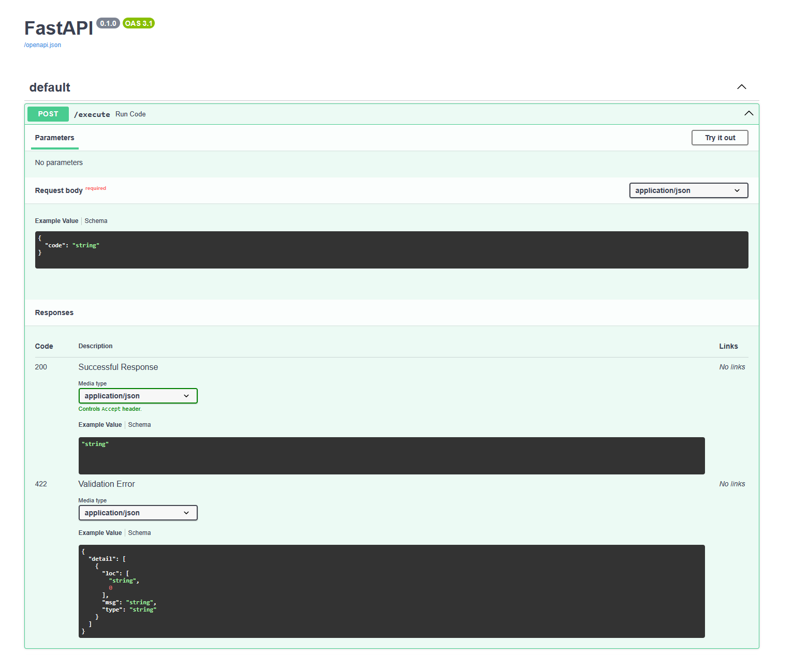
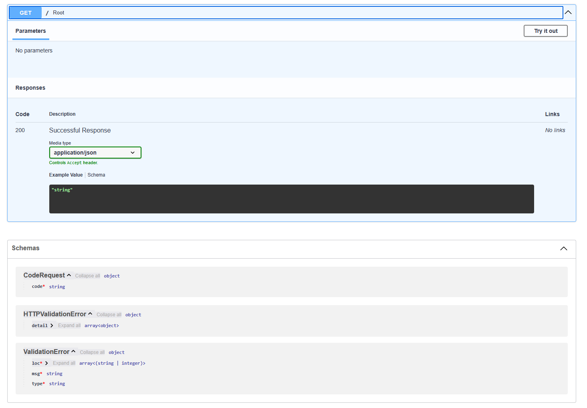
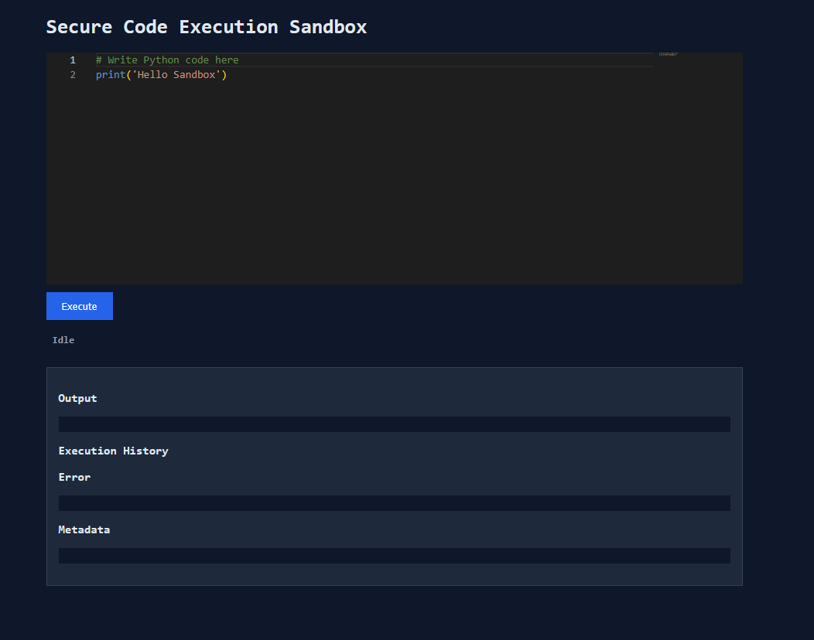
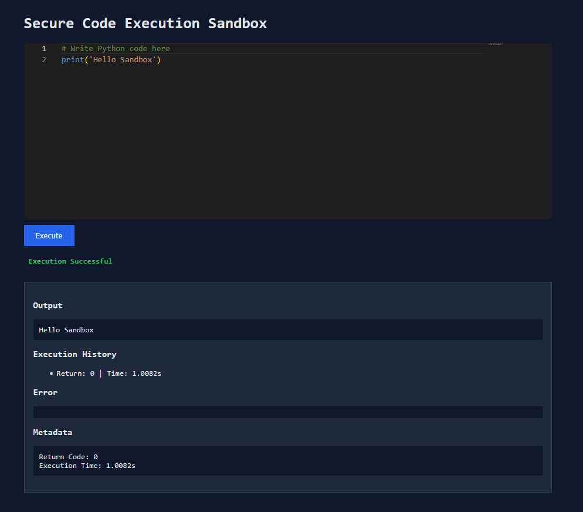

# **Secure Sandboxed Code Execution Engine**

A containerized execution environment that accepts arbitrary user-submitted code, runs it in complete isolation, and returns the output — without exposing the host system to risk.

## **Overview**

This project addresses the core challenge of running untrusted code safely: combining container-level isolation with explicit resource constraints, AST-based static analysis, and output sanitisation to prevent any single submission from affecting the host or other users.
### **Execution Pipeline**

    User Input → API → Isolated Runner → Resource Limiter → Output Sanitizer → Response

### **Enforced constraints per execution:**

| Constraint                 | Value               | Enforced By                       |
| :------------------------- | :------------------ | :-------------------------------- |
| CPU                        | 1 core max          | Docker `--cpus`                   |
| Memory                     | 100 MB max          | Docker `--memory`                 |
| Process count              | 64 max              | Docker `--pids-limit`             |
| Network                    | Blocked             | Docker `--network=none`           |
| Filesystem                 | Read-only workspace | *Docker volume mount              |
| Execution time             | 3 seconds           | `subprocess` timeout              |
| Code size                  | 64 KB max           | API layer                         |
| Output size                | 100 KB max          | Output Sanitizer                  |
| Concurrent executions      | 2 max               | Asyncio semaphore                 |

### **Security Design**

#### Layer 1 — Static Analysis (pre-execution)
Before any container is spawned, submitted code is parsed into an Abstract Syntax Tree (AST) and checked for forbidden constructs — dangerous imports (`os`, `sys`, `subprocess`, `socket`, `ctypes`, `importlib`), and direct calls to `eval`, `exec`, or `compile`.

AST-based analysis is significantly more reliable than string matching. It catches `import os`, `import  os (extra whitespace)`, `from os import *`, and `import os as x` identically, and cannot be fooled by spacing or casing tricks that defeat a keyword blocklist.

Code that fails static analysis is rejected immediately — no container is spawned.

#### Layer 2 — Container Isolation (runtime)
Even if a submission bypasses static analysis (via obfuscation, indirect imports, or dynamic execution), the Docker container boundary enforces hard limits:

- No network access — --network=none blocks all outbound and inbound connections at the daemon level
- Process cap — --pids-limit=64 prevents fork bomb attacks from exhausting the host PID namespace
- Resource cap — CPU and memory limits prevent runaway computation from starving the host
- Non-root execution — user code runs as an unprivileged user inside the container
- Ephemeral container — created per-request, destroyed immediately after (--rm); no state persists between submissions

The worst-case outcome of a container-layer bypass is a stalled or killed container. The host and all other containers are unaffected.

#### Layer 3 — Output Sanitisation (post-execution)
Raw container output is filtered before being returned to the client:

- Output exceeding 100 KB is truncated
- ANSI escape sequences are stripped to prevent terminal injection
 
### **Fork Bomb Mitigation**
A fork bomb recursively spawns child processes until the system's PID namespace is exhausted, rendering the machine unresponsive.
```python
#Classic fork bomb
import os
while True:
    os.fork()
```
The container is launched with `--pids-limit=64`. When the limit is reached, `fork()` fails with `EAGAIN` — the bomb exhausts itself within the container's isolated PID namespace without touching the host. The container stalls or is killed, and an error is returned to the user.

## **Project Strcuture**

```
    Secure-Sandbox/
    ├── api/
    │   └── app.py              # FastAPI application, rate limiting, concurrency control
    ├── runner/
    │   └── executor.py         # Docker container orchestration, execution logic
    ├── security/
    │   └── validator.py        # AST-based static code analysis
    ├── static/
    │   ├── index.html          # Frontend UI
    │   ├── script.js           # Monaco editor integration, API calls
    │   └── style.css           # Styling
    ├── config.py               # Centralised configuration (limits, timeouts)
    ├── Dockerfile              # Main API server image
    ├── Dockerfile.runtime      # Isolated execution runtime image
    ├── Requirements.txt        # Python dependencies
    └── .gitignore
```

## **Getting Started**

### Prerequisites
- Docker and Docker Compose
- Python 3.8+
- pip

### Install Docker (Linux):
```bash
    sudo apt update
    sudo apt install docker.io docker-compose -y
```
**Windows** : Download and install Docker Desktop. Ensure the Docker Engine is running before proceeding

## **Setup**

### 1. Clone the repository
```bash
git clone https://github.com/PYatiM/Secure-Sandbox.git
cd Secure-Sandbox
```

If your system cloned the folder with an underscore, use `cd Secure_Sandbox` instead.

### 2. Install Python dependencies
```bash
pip install -r Requirements.txt
```

### 3. Build the sandbox runtime image
Ensure Docker is running, then build the isolated execution environment:
```bash
docker build -t sandbox_runtime -f Dockerfile.runtime .
```

### 4. Start the API server
```bash
uvicorn api.app:app --host 0.0.0.0 --port 8000
```

### 5. Open the application

Navigate to http://localhost:8000 in your browser.

## **Configuration**
All tunable parameters are centralised in `config.py` and can be overridden via environment variables:

|Variable             |Default     |Description                        |
| :------------------ | :--------- | :-------------------------------- |
|RATE_LIMIT           |    10      |Max requests per minute per IP     |
|EXECUTION_TIMEOUT    |    3       |Max seconds a container may run    |
|MEMORY_LIMIT         |    100m    |Docker memory cap per container    |
|CPU_LIMIT            |    1       |Docker CPU cap per container       |
|PIDS_LIMIT           |    64      |Max processes per container        |
|MAX_CONCURRENT       |    2       |Max parallel container executions  |
|MAX_CODE_SIZE        |    65536   |Max submitted code size in bytes   |

## **Architecture Notes**
The API layer (FastAPI + Uvicorn) receives code submissions and passes them through static analysis before handing off to the executor. The executor writes the submitted code to a temporary file on the host, mounts it read-only into a fresh Docker container, and runs it. The container is ephemeral — created per execution and destroyed immediately after — ensuring no state persists between submissions.

Resource constraints are enforced at the Docker daemon level, not in application code, making them significantly harder to bypass than application-level checks. Static analysis at the API layer acts as a first filter that prevents obviously dangerous submissions from ever reaching the container layer.

Rate limiting is applied per client IP with a sliding window to prevent abuse. A semaphore limits concurrent container executions to prevent resource exhaustion from simultaneous submissions.

## **Images**

### Bare Post method in the backend


### Bare Get method in the backend


### Starting run UI


### Sample execution UI


